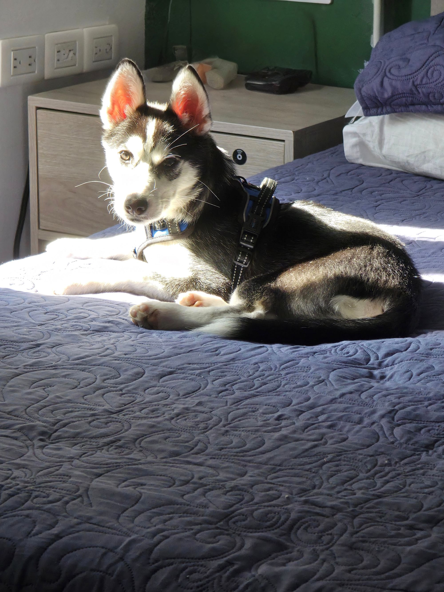

# Aizen Pomsky – Dynamic Pet Profile



## Overview

**Aizen Pomsky** is a dynamic and responsive web profile for Aizen, a fifth-generation Pomsky. The site displays his photo timeline, health history, medical appointments, growth chart, and curiosities—all automatically updated from a Google Spreadsheet.

---

## Features

- **Live Data:** All information is loaded from a shared Google Spreadsheet—no need to edit the code to update the website.
- **Dynamic Sections:** Profile photo, weight, age, vaccine/deworming history, medical appointments, notes, and photo gallery update in real time.
- **Responsive UI:** Modern, animated design with Tailwind CSS, optimized for desktop and mobile.
- **Interactive Elements:** Photo modals allow for zooming and downloading, and weight is shown in a Chart.js graph.

---

## How It Works

All data is stored in a Google Spreadsheet and loaded via CSV export.

### Main Sheets

- **Fotos:** Profile photo, photo timeline (`Date, Image, Comment`)
- **Vacunas:** Vaccination records
- **Desparasitacion:** Deworming records
- **Peso:** Weight log (`Date, Weight`)
- **Citas Medicas:** Medical appointments (`Date, Place, Comment`)
- **Notas:** Notes and curiosities (one per row)

### To Update the Website

1. **Open the [Google Spreadsheet](https://docs.google.com/spreadsheets/d/13sGO1cTDbwVRtPsaoxQy_3rKKt90Ievus5_5YJen_WY/edit)**
2. Edit or add entries in the corresponding sheet.
   - To update the profile photo, upload a new image named `profile.jpg` in the **Fotos** sheet.
   - Add or update vaccines, weights, appointments, or notes in their respective tabs.
3. Reload the web page to see the changes—**no code updates needed**.

---

## Local Development

1. **Clone the repo:**
   ```bash
   git clone https://github.com/afishingday/AizenPomsky.git
   cd AizenPomsky
